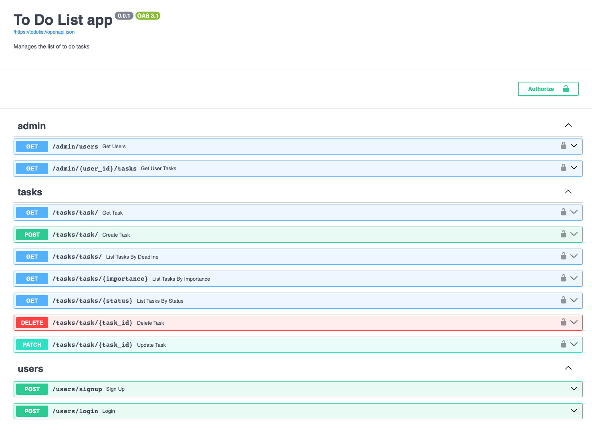

# Task Management Application


### Description
Base FastApi project for applying general RestAPI application cases to manage tasks


### Concept
1. minimal functionality
2. Easy to read
3. Convincing architecture


### Base models
1. user
2. task


### Integrated with
1. Python3.9+
2. Fastapi 0.99.1
3. Database PostgreSQL
4. Docker 24.0.7
5. JWT authentication


### Server
1. uvicorn app.main:app --reload
2. options
    1. host: `--host 0.0.0.0`
    2. port: `--port 8080`


### How to run with Docker Compose
1. Install Docker 
2. Create .env file
3. Run `docker-compose up -d` in the terminal. The -d flag runs the containers in the background. The services defined in the docker-compose.yml file, such as the FastAPI application and PostgreSQL database, will be built and started. 
4. Access the FastAPI application by navigating to http://localhost:8080 in your web browser.

### Sample .env file format:
```dotenv
    ENV=env
    DB=postgresql
    DB_USER=
    DB_PASSWORD=
    DB_HOST=localhost
    DB_PORT=5432
   
    MY_SECRET_KEY="MY_SECRET_KEY_VALUE"
```

### References
1. [FastAPI official docs](https://fastapi.tiangolo.com/)
2. [Alembic official tutorial](https://alembic.sqlalchemy.org/en/latest/tutorial.html)
3. [Docker official tutorial](https://docs.docker.com/get-started/) 